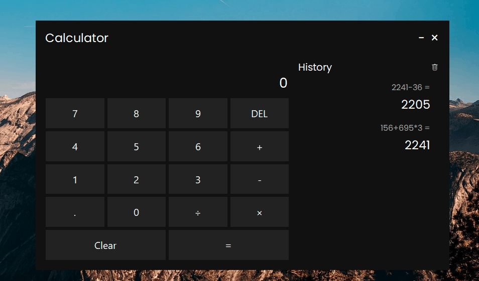

# Calculator

This is a simple calculator that can be used to perform basic arithmetic operations and save history locally. It is written in the Python programming 
language and uses 
**PyQt6** for user interface.

